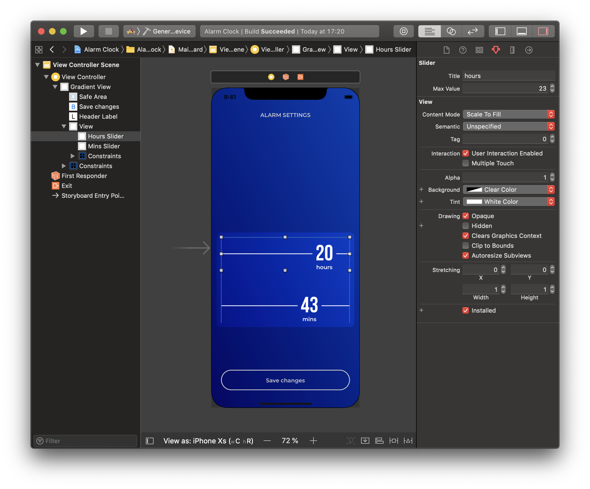

# ⏰ Alarm Clock
Proof of concept for our [Colored Alarm Clock Interface shot @ Dribbble](https://dribbble.com/shots/5054031-Colored-Alarm-Clock-Interface)

Slider implemented as a subclass of UIControl. You can set slider title and max value right in Attributes Inspector in Interface Builder, thanks to @IBInspectable. Also you can choose Slider color using Tint Color property. And there is no need to run simulator to see final result – components are fully rendered in storyboard by @IBDesignable.

Feel free to use this code in your projects and  me if you have any questions or suggestions.
